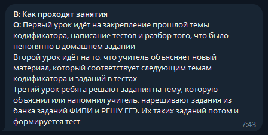
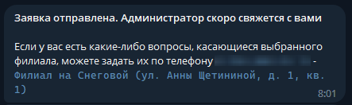

# Документация

- [Настройка окружения для разработки](#настройка-окружения-для-разработки)
- [Разработка](#разработка)
- [Использование](#использование)

## Настройка окружения для разработки

- [Для пользователей Windows](#настройка-окружения-для-пользователей-windows)
- [Для пользователей Linux](#настройка-окружения-для-пользователей-linux)

### Настройка окружения для пользователей Windows

1. Установить среду выполнения [Node.JS](https://nodejs.org/en)

   - Перейти по ссылке на официальный сайт [Node.JS](https://nodejs.org/en), скачать и установить последнюю актуальную **LTS** версию
   - После установки открыть терминал в любом месте и убедиться, что установка прошла успешно

     ```bash
       $ node -v
     ```

     ```bash
       $ npm -v
     ```

2. Установить компилятор [TypeScript](https://www.typescriptlang.org/download) любым из предложенных способов

   - Открыть терминал в любом месте и установить TypeScript **глобально**

     ```bash
       $ npm i -g typescript
     ```

   - Открыть терминал в корневой папке проекта и установить TypeScript **локально**

     ```bash
       $ npm i -D typescript
     ```

3. Создать собственного бота в Telegram

   - Перейти в личные сообщения с [BotFather](https://t.me/BotFather)

   - Создать нового бота

     ```bash
       /newbot
     ```

   - После указания названия и имени бота получить `TOKEN`

4. Настроить переменные окружения

   - В корневой папке проекта создать пустой файл `.env`
   - В только что созданном файле объявить переменные:

     ```env
       TELEGRAM_TOKEN='<TOKEN БОТА ТЕЛЕГРАММ>' # Токен используемого Телеграмм бота

       MAIL_SERVICE_DOMAIN='<ДОМЕН ПОЧТОВОГО СЕРВИСА>' # Домен почтового сервиса для отправки писем
       MAIL_SERVICE_PORT='<ПОРТ ПОЧТОВОГО СЕРВИСА>' # Порт почтового сервиса для отправки писем
       MAIL_SERVICE_USER='<АДРЕС ЭЛЕКТРОННОЙ ПОЧТЫ>' # Адрес электронной почты, с которого будут присылаться письма
       MAIL_SERVICE_PASSWORD='<ПАРОЛЬ ОТ ЭЛЕКТРОННОЙ ПОЧТЫ>' # Пароль от электронной почты, с которого будут присылаться письма
     ```

5. Настроить конфигурацию менеджера библиотек

   - В корневой папке проекта создать пустой файл `.npmrc`
   - В только что созданном файле объявить переменные:

     ```npmrc
       registry=https://registry.npmjs.org/
       @var3n1k:registry=https://npm.pkg.github.com/
       //npm.pkg.github.com/:_authToken=<ТОКЕН ДЛЯ СКАЧИВАНИЯ БИБЛИОТЕК> # Токен для скачивания библиотек @var3n1k/
     ```

6. Собрать текущую версию приложения
   - Запустить файл `#Dependencies Install` из корневой папки проекта для установки зависимостей (**`#Dependencies Update` НЕ ЗАПУСКАТЬ**)
   - Запустить файл `#Build` из корневой папки проекта для сборки приложения (`запускать после каждого сохраненного изменения в папке ./src`)
   - Запустить файл `#RunProd` из корневой папки проекта для запуска собранной Production-версии приложения

### Настройка окружения для пользователей Linux

1. Установить среду выполнения [Node.JS](https://nodejs.org/en)

   - Открыть терминал в любом месте и скачать скрипт установки Node.JS

     ```bash
       $ curl -sL https://deb.nodesource.com/setup_14.x -o nodesource_setup.sh
       $ sudo bash nodesource_setup.sh
       $ sudo apt install nodejs
     ```

   - После установки открыть терминал в любом месте и убедиться, что установка прошла успешно

     ```bash
       $ node -v
     ```

     ```bash
       $ npm -v
     ```

2. Установить компилятор [TypeScript](https://www.typescriptlang.org/download) любым из предложенных способов

   - Открыть терминал в любом месте и установить TypeScript **глобально**

     ```bash
       $ npm i -g typescript
     ```

   - Открыть терминал в корневой папке проекта и установить TypeScript **локально**

     ```bash
       $ npm i -D typescript
     ```

3. Создать собственного бота в Telegram

   - Перейти в личные сообщения с [BotFather](https://t.me/BotFather)

   - Создать нового бота

     ```bash
       /newbot
     ```

   - После указания названия и имени бота получить `TOKEN`

4. Настроить переменные окружения

   - В корневой папке проекта создать пустой файл `.env`
   - В только что созданном файле объявить переменные:

     ```env
       TELEGRAM_TOKEN='<TOKEN БОТА ТЕЛЕГРАММ>' # Токен используемого Телеграмм бота

       MAIL_SERVICE_DOMAIN='<ДОМЕН ПОЧТОВОГО СЕРВИСА>' # Домен почтового сервиса для отправки писем
       MAIL_SERVICE_PORT='<ПОРТ ПОЧТОВОГО СЕРВИСА>' # Порт почтового сервиса для отправки писем
       MAIL_SERVICE_USER='<АДРЕС ЭЛЕКТРОННОЙ ПОЧТЫ>' # Адрес электронной почты, с которого будут присылаться письма
       MAIL_SERVICE_PASSWORD='<ПАРОЛЬ ОТ ЭЛЕКТРОННОЙ ПОЧТЫ>' # Пароль от электронной почты, с которого будут присылаться письма
     ```

5. Настроить конфигурацию менеджера библиотек

   - В корневой папке проекта создать пустой файл `.npmrc`
   - В только что созданном файле объявить переменные:

     ```npmrc
       registry=https://registry.npmjs.org/
       @var3n1k:registry=https://npm.pkg.github.com/
       //npm.pkg.github.com/:_authToken=<ТОКЕН ДЛЯ СКАЧИВАНИЯ БИБЛИОТЕК> # Токен для скачивания библиотек @var3n1k/
     ```

6. Собрать текущую версию приложения

   - Открыть терминал в корневой папке проекта и установить требуемые зависимости (**`npm i` / `npm install` / `npm update` НЕ ЗАПУСКАТЬ**)

     ```bash
       $ npm ci
     ```

   - Начать сборку приложения (`запускать после каждого сохраненного изменения в папке ./src`)

     ```bash
       $ npm run build
     ```

   - Запустить собранную Production-версию приложения
     ```bash
       $ npm run prod
     ```

## Разработка

- [Подключение библиотек](#подключение-библиотек)

### Подключение библиотек

- Используемые библиотеки

  - [@var3n1k/server-core](https://github.com/var3n1k/ServerCore/pkgs/npm/server-core)
  - [@var3n1k/telegram](https://github.com/var3n1k/Telegram/pkgs/npm/telegram)
  - [@var3n1k/mail](https://github.com/var3n1k/Mail/pkgs/npm/mail)

- Подключение библиотек осуществляется через стандартные пакетные менеджеры `NodeJS`

  ```bash
    $ npm install @var3n1k/server-core
    $ npm install @var3n1k/telegram
    $ npm install @var3n1k/mail
  ```

  ```bash
    $ yarn add @var3n1k/server-core
    $ yarn add @var3n1k/telegram
    $ yarn add @var3n1k/mail
  ```

  ```bash
    $ pnpm add @var3n1k/server-core
    $ pnpm add @var3n1k/telegram
    $ pnpm add @var3n1k/mail
  ```

### Конфигурация

- [Конфигурация часто-задаваемых вопросов](#конфигурация-часто-задаваемых-вопросов)
- [Конфигурация услуг и расценок](#конфигурация-услуг-и-расценок)
- [Конфигурация контактов обратной связи для филиалов](#конфигурация-контактов-обратной-связи-для-филиалов)
- [Конфигурация изучаемых предметов](#конфигурация-изучаемых-предметов)
- [Конфигурация администраторов](#конфигурация-администраторов)

#### Конфигурация часто-задаваемых вопросов

- Конфигурация часто-задаваемых вопросов находится в файле `src/module/dataset/dictionary/faq.ts`

  - Для добавления нового вопроса следует в массив `FAQ` добавить новый объект

    ```ts
    {
      Question: {
        Main: ``, // Основной вопрос
        Aliases: [], // Альтернативные вопросы
      },
      Answer: ``, // Ответ на основной вопрос
    }
    ```

#### Конфигурация услуг и расценок

- Конфигурация услуг и расценок находится в файле `src/module/dataset/dictionary/service.ts`

  - Для добавления новой услуги следует в массив `Services` добавить новый объект

    ```ts
    {
      Name: ``, // Название услуги
      Description: ``, // Описание услуги
      Price: 0, // Цена за услугу в рублях
    }
    ```

#### Конфигурация контактов обратной связи для филиалов

- Конфигурация контактов обратной связи для филиалов находится в файле `src/module/dataset/dictionary/branch.ts`

  - Для добавления нового филиала следует в массив `Branches` добавить новый объект

    ```ts
    {
      Name: ``, // Наименование филиала
      Adress: ``, // Адрес филиала
      Phone: {
        Number: ``, // Контактный номер телефона
      },
    }
    ```

#### Конфигурация изучаемых предметов

- Конфигурация изучаемых предметов находится в файле `src/module/dataset/dictionary/subject.ts`

  - Для добавления нового предмета следует в массив `Subjects` добавить новый объект

    ```ts
    {
      Name: ``, // Наименование предмета
      Grade: {
        Minimum: 0, // Минимальный класс обучения
        Maximum: 0, // Максимальный класс обучения
      },
    }
    ```

#### Конфигурация администраторов

- Конфигурация администраторов находится в файле `src/module/dataset/dictionary/admin.ts`

  - Для добавления нового контакта администратора следует в массив `Admin.Contact.List` добавить новый объект

    ```ts
    {
      Name: ``, // Контактное лицо
      Phone: {
        Number: ``, // Контактный номер телефона
      },
    }
    ```

  - Для добавления нового адреса электронной почты администратора следует в массив `Admin.Email.Adress.List` добавить новый адрес в формате `email@adress.domain`

### Обработчики

- [Обработчики событий](#обработчики-событий)
- [Обработчики сообщений](#обработчики-сообщений)
- [Обработчики взаимодействий](#обработчики-взаимодействий)
- [Обработчики команд](#обработчики-команд)

#### Обработчики событий

- Обработчики событий размещаются в папке `src/api/Telegram/Events`. Для создания обработчика рекомендуется использовать [шаблон обработчика событий](https://github.com/var3n1k/Telegram/pkgs/npm/telegram#%D0%BE%D0%B1%D1%80%D0%B0%D0%B1%D0%BE%D1%82%D1%87%D0%B8%D0%BA-%D1%81%D0%BE%D0%B1%D1%8B%D1%82%D0%B8%D0%B9) из библиотеки [@var3n1k/telegram](https://github.com/var3n1k/Telegram/pkgs/npm/telegram)

#### Обработчики сообщений

- Обработчики сообщений размещаются в папке `src/api/Telegram/Messages`. Для создания обработчика рекомендуется использовать [шаблон обработчика сообщений](https://github.com/var3n1k/Telegram/pkgs/npm/telegram#%D0%BE%D0%B1%D1%80%D0%B0%D0%B1%D0%BE%D1%82%D1%87%D0%B8%D0%BA-%D1%81%D0%BE%D0%BE%D0%B1%D1%89%D0%B5%D0%BD%D0%B8%D0%B9) из библиотеки [@var3n1k/telegram](https://github.com/var3n1k/Telegram/pkgs/npm/telegram)

#### Обработчики взаимодействий

- [Обработчики нажатий на кнопку](#обработчики-нажатий-на-кнопку)

##### Обработчики нажатий на кнопку

- Обработчики нажатий на кнопку размещаются в папке `src/api/Telegram/Action/Components/Buttons`. Для создания обработчика рекомендуется использовать [шаблон обработчика нажатий на кнопку](https://github.com/var3n1k/Telegram/pkgs/npm/telegram#%D0%BE%D0%B1%D1%80%D0%B0%D0%B1%D0%BE%D1%82%D1%87%D0%B8%D0%BA-%D0%BD%D0%B0%D0%B6%D0%B0%D1%82%D0%B8%D0%B9-%D0%BD%D0%B0-%D0%BA%D0%BD%D0%BE%D0%BF%D0%BA%D1%83) из библиотеки [@var3n1k/telegram](https://github.com/var3n1k/Telegram/pkgs/npm/telegram)

#### Обработчики команд

- [Обработчики слэш-команд](#обработчики-слэш-команд)

##### Обработчики слэш-команд

- Обработчики слэш-команд размещаются в папке `src/api/Telegram/Commands/Slash`. Для создания обработчика рекомендуется использовать [шаблон обработчика слэш-команд](https://github.com/var3n1k/Telegram/pkgs/npm/telegram#%D0%BE%D0%B1%D1%80%D0%B0%D0%B1%D0%BE%D1%82%D1%87%D0%B8%D0%BA-%D1%81%D0%BB%D1%8D%D1%88-%D0%BA%D0%BE%D0%BC%D0%B0%D0%BD%D0%B4) из библиотеки [@var3n1k/telegram](https://github.com/var3n1k/Telegram/pkgs/npm/telegram)

## Использование

- [Добавление бота](#добавление-бота)
- [Часто-задаваемые вопросы](#часто-задаваемые-вопросы)
- [Обратная связь](#обратная-связь)
- [Услуги и расценки](#услуги-и-расценки)
- [Запись на курс](#запись-на-курс)

### Добавление бота

- Для добавления бота [Formula ЕГЭ](http://t.me/FormulaEGEBot) перейдите по ссылке и введите любую из нижепредложенных команд

  

### Часто-задаваемые вопросы

- Список известных часто-задаваемых вопросов можно получить, использовав команду `/faq`

  

  - После выбора нужного вопроса бот отредактирует свое сообщение, поместив в нем ответ на выбранный вопрос

    

- При отправке боту сообщения, приблизительно содержащего в себе контекст часто-задаваемого вопроса, вы получите на него ответ

  - Так, если написать боту `Как занятия с учениками у вас проходят`, вы получите ответ на вопрос `Как проходят занятия`

    

  - Или чтобы получить ответ на вопрос `Какие предметы у вас преподают`, можно написать боту сообщение `Покажи предметы, которые у вас преподают`

    

### Обратная связь

- Доступные контакты для обратной связи всех филиалов Формула ЕГЭ можно получить, использовав команду `/contacts` (номера телефонов **копируются по нажатию**)

  

### Услуги и расценки

- Список всех предоставляемых услуг и их расценок можно получить, использовав команду `/pricing`

  

### Запись на курс

- Запись на курс происходит через команду `/registration`

  

  - Первоначальное заполнение заявки включает в себя

    - ФИО заказчика (родителя)

      

      - ФИО должно быть написано в одну строку, разделенную пробелами. Регистр неважен

    - ФИО обучающегося (ребенка)

      - ФИО должно быть написано в одну строку, разделенную пробелами. Регистр неважен

      

    - Контактный номер телефона

      

      - Номер телефона может иметь форматы `8 9...` / `+7 9...` / `7 9...` / `9...`

    - Контактный адрес электронной почты

      

    - Класс обучения

      

    - Желаемые предметы для изучения (предлагаются на основе выбранного класса, некоторые предметы недоступны для 6 класса -> они не будут предложены, если выбран 6 класс)

      

      - Предметы выбираются из списка существующих через нажатие кнопок
      - Количество выбираемых предметов неограничено

    - Подходящий филиал

      

      - Филиал выбирается из списка существующих через нажатие кнопок

  - После первоначального заполнения вам будет предложено отредактировать данные, либо отправить заявку (все данные в превью заявки **копируются по нажатию**)

    

    - При попытке отправить заявку у вас будет запрошено подтверждение

      

      - После подтверждения заявки вам высветится уведомление о том, что заявка направлена администраторам и сообщение с контактными данными выбранного филиала

        
        

    - **`ЕСЛИ ВЫ ЗАКАЗЧИК КУРСА`** После подтверждения заявки на указанную в заявке электронную почту придет подтверждение с копией вашей заявки и контактными данными выбранного при регистрации филиала

      

    - **`ЕСЛИ ВЫ АДМИНИСТРАТОР`** После заполнения новой заявки, на все электронные почты администраторов (если они указаны в конфигурации бота) придет подтверждение с копией заявки

      
